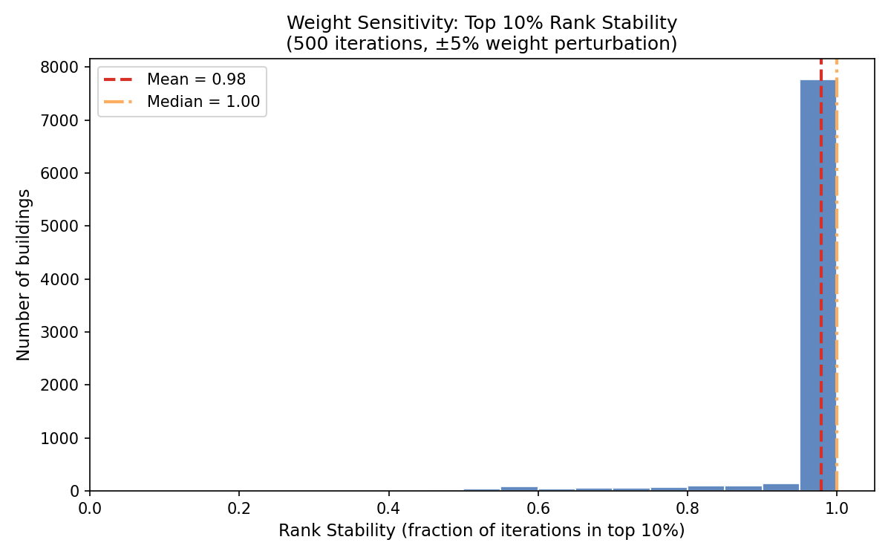
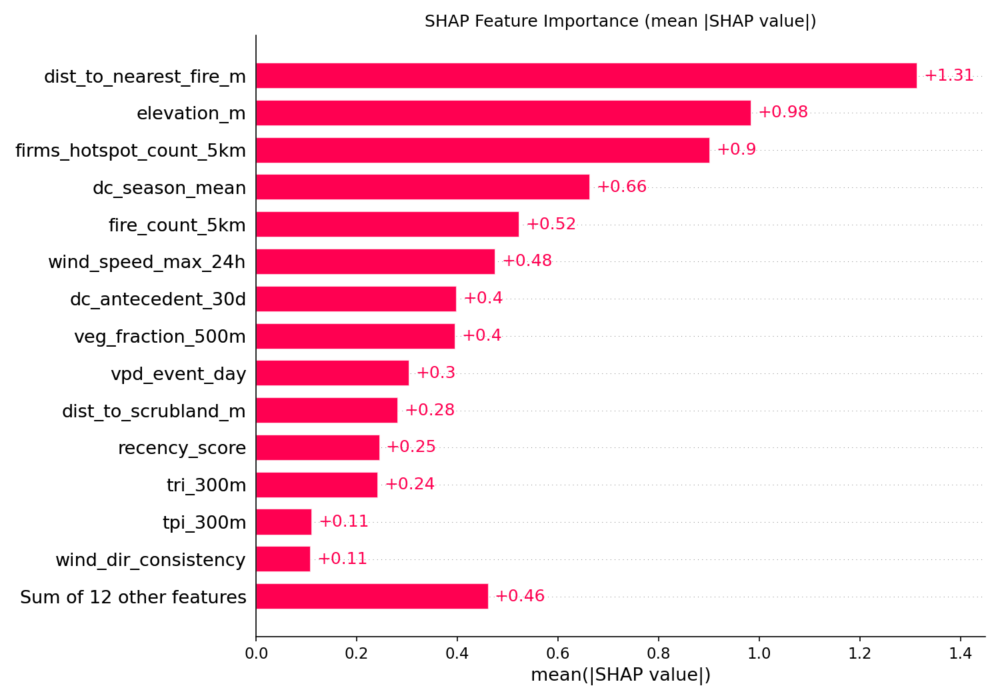
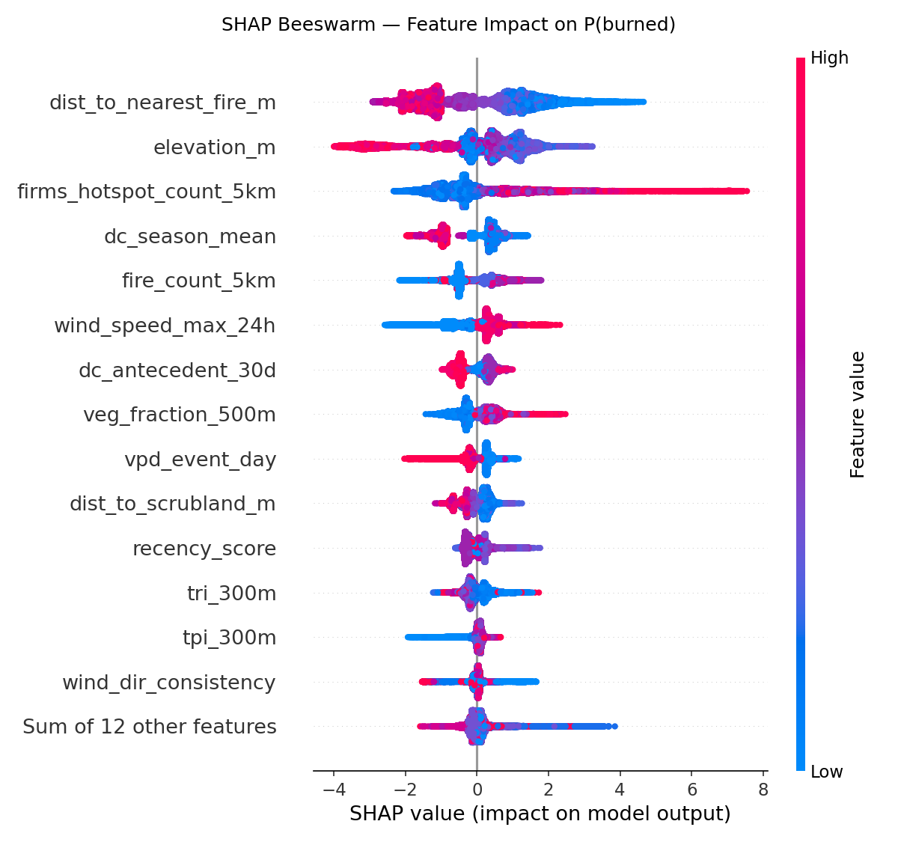

# WildfireRisk-EU: Layered Wildfire Risk Intelligence for Mediterranean WUI

[](https://github.com/trouties/wildfire-risk-eu-pipeline/actions)
[](https://www.python.org/downloads/release/python-3110/)
[](LICENSE)
[](https://lightgbm.readthedocs.io/)
[](https://duckdb.org/)

A reproducible geospatial data pipeline that scores **226,314 buildings** in the Athens wildland-urban interface (WUI) for wildfire risk using a **two-layer architecture** — structural susceptibility plus event-context dynamics — validated against **four historical fires** with LightGBM and SHAP explainability.

> **[Live Demo: Interactive Risk Map](https://trouties.github.io/wildfire-risk-eu-pipeline/)** — 226K buildings color-coded by risk class on an interactive Folium map

| | |
|---|---|
| **Stakeholder** | Re/insurance portfolio underwriter assessing European wildfire exposure |
| **AOI** | Attica Region, Greece (2,500 km² · EPSG:2100) |
| **Validation** | Leave-one-event-out against 4 Attica fires (Kalamos 2015, Mati 2018, Varybobi 2021, Acharnes 2021) |
| **Key Outputs** | [Executive Memo](outputs/summaries/executive_memo.md) · [Validation Report](outputs/reports/validation_report.md) · [Interactive Map](https://trouties.github.io/wildfire-risk-eu-pipeline/) |

---

## v2 Architecture

```
Layer 1: Structural Susceptibility (v1)
  "This building is in a long-run high-risk zone"
  → terrain, vegetation, fire weather climatology, fire history
  → 21 features → weighted composite index

Layer 2: Event-Context Dynamic (v2)
  "Under today's conditions, this building's risk is amplified/dampened"
  → ERA5 hourly wind speed/direction, VPD, antecedent drought, event-day FWI
  → 5 features → LightGBM binary classifier → SHAP explainability

Combined: Impact-Priority Score
  → structural × event-context → prioritized risk ranking
```

### Pipeline Stages

```
┌──────────────┐    ┌──────────────┐    ┌──────────────┐    ┌──────────────┐
│  Stage 1a    │    │  Stage 2     │    │  Stage 3a    │    │  Stage 4     │
│  Acquire     │───▶│  Preprocess  │───▶│  Structural  │───▶│  Scoring     │
│  (structural)│    │              │    │  Features    │    │  (v1 index)  │
└──────────────┘    └──────────────┘    └──────────────┘    └──────┬───────┘
                                                                   │
┌──────────────┐    ┌──────────────┐    ┌──────────────┐           ▼
│  Stage 1b    │    │  Stage 3b    │    │  Stage 5b    │    ┌──────────────┐
│  Acquire ERA5│───▶│  Dynamic     │───▶│  LightGBM    │───▶│  Stage 5     │
│  (hourly)    │    │  Features    │    │  + SHAP      │    │  Validation  │
└──────────────┘    └──────────────┘    └──────────────┘    └──────┬───────┘
                                                                   │
                                                                   ▼
                                                            ┌──────────────┐
                                                            │  Stage 6     │
                                                            │  Outputs     │
                                                            └──────────────┘
                                              DuckDB storage
                                           (data/wildfire_risk.duckdb)
```

---

## Quick Start

```bash
# 1. Create and activate conda environment
conda env create -f environment.yml
conda activate geo311

# 2. Install package in editable mode
pip install -e ".[dev]"

# 3. Run full v2 pipeline (structural + event-context + model)
make all-v2

# Or run v1 structural pipeline only:
make all

# Or run stages individually:
make acquire            # Stage 1a: structural data sources
make acquire-dynamic    # Stage 1b: ERA5 hourly event-context data
make preprocess         # Stage 2:  clean, harmonize, load to DuckDB
make features           # Stage 3a: structural per-building features
make features-dynamic   # Stage 3b: event-context dynamic features
make score              # Stage 4:  v1 weighted composite index
make validate           # Stage 5:  backtest (4 LOEO events)
make model              # Stage 5b: LightGBM + SHAP
make outputs            # Stage 6:  deliverables (reports, maps, tables)
```

---

## Data Sources

| Source | Provider | Resolution | License |
|--------|----------|------------|---------|
| OSM Buildings | OpenStreetMap | Building-level | ODbL |
| Copernicus GLO-30 DEM | Copernicus | 30m | Free |
| CORINE Land Cover 2018 | CLMS | 100m | Free |
| EFFIS Fire Perimeters | JRC | Vector | Free |
| FWI (ERA5-Land daily) | CDS/ECMWF | ~9km | Free |
| ERA5-Land hourly (v2) | CDS/ECMWF | ~9km | Free |
| NDVI HR-VPP | CLMS | 10m | Free |
| FIRMS VIIRS | NASA | 375m | Free |

See `config/data_sources.yaml` for download endpoints and the [Credentials Required](#credentials-required) section below.

---

## Features

### Layer 1: Structural Features (21 effective, 4 groups)

| Group | Weight\* | Features |
|-------|---------|---------|
| Vegetation | 33% | veg\_fraction (100m/500m), dist\_to\_forest, dist\_to\_scrubland, wui\_class, veg\_continuity |
| Terrain | 22% | elevation, slope, south\_aspect\_score, TPI, TRI |
| Fire Weather | 22% | FWI mean/p90/max, Drought Code, extreme-FWI days |
| Fire History | 22% | nearest fire distance, fire counts 5/10km, FIRMS hotspots, recency score |

\*Proximity weight (10%) redistributed proportionally to the 4 present groups at runtime.

### Layer 2: Event-Context Dynamic Features (5, v2)

| Feature | Source | Description |
|---------|--------|-------------|
| `wind_speed_max_24h` | ERA5 hourly u10/v10 | Max wind speed (m/s) in 24h pre-event window |
| `wind_dir_consistency` | ERA5 hourly u10/v10 | 1 / circular\_std of wind direction (12h window) |
| `vpd_event_day` | ERA5 hourly t2m/d2m | Max vapor pressure deficit (hPa) on event day |
| `dc_antecedent_30d` | FWI daily | Mean Drought Code in 30 days before event |
| `fwi_event_day` | FWI daily | FWI value on event date |

---

## Validation Results

### 4 Events × 2 Layers Matrix (Leave-One-Event-Out)

| Event | Fire type | v1 Structural AUC [95% CI] | v2 LOEO AUC [95% CI] | Δ AUC |
|-------|-----------|---------------------------|----------------------|-------|
| Kalamos 2015 | Terrain-driven | 0.779 [0.69, 0.86] | 0.373 [0.27, 0.47] | −0.406 |
| Mati 2018 | Wind-driven | 0.431 [0.42, 0.45] | **0.715** [0.70, 0.73] | **+0.283** |
| Varybobi 2021 | Terrain-driven | 0.748 [0.74, 0.76] | 0.435 [0.42, 0.45] | −0.313 |
| Acharnes 2021 † | Suburban encroachment | 0.502 [0.49, 0.52] | **0.737** [0.73, 0.74] | **+0.235** |
| **Mean (in-distribution)** | | **0.653** | **0.508** | **−0.145** |

† Acharnes 2021 is an **out-of-distribution exploratory event** — suburban encroachment fire type not represented in the feature space. Excluded from aggregate metrics. See [Limitations](#limitations).

### Interpretation

- **Kalamos 2015** (v1 AUC 0.78): Best-performing structural event. Terrain/fuel-driven fire in low-density rural area — exactly the scenario the structural layer was designed for. v2 degrades (0.37) due to OOD training contamination from Acharnes suburban patterns.
- **Mati 2018** (v2 AUC 0.72): v2 dynamic layer improves discrimination by +0.28, the largest gain across all events. Wind speed and VPD features capture the acute meteorological conditions that v1 structural features miss.
- **Varybobi 2021** (v1 AUC 0.75): Structural model passes the 0.70 target. v2 degrades (0.44) — same OOD contamination pattern as Kalamos.
- **Acharnes 2021** (v2 AUC 0.74): v2 dynamic layer dramatically improves from v1 chance-level (0.50) to a passing score. The expanded building coverage (60K buildings) provides sufficient suburban training data for the LightGBM model.
- **Layer complementarity**: v1 excels on terrain-driven fires (Kalamos, Varybobi); v2 excels on wind-driven and suburban fires (Mati, Acharnes). Neither layer dominates across all fire types, motivating fire-type-aware model selection in v3.
- **Leakage mitigation**: Fire history features excluded from LOEO due to temporal leakage (test event's own perimeter included in feature computation). See [docs/leakage_audit.md](docs/leakage_audit.md) for a per-feature audit of all 26 features.

### ROC Curves (Leave-One-Event-Out)

<p align="center">
  
  
  
  
</p>

### Applicability Boundaries

| Fire type | v1 Structural | v2 Dynamic | Root cause |
|-----------|---------------|------------|------------|
| Terrain/fuel-driven (Kalamos) | PASS (0.78) | FAIL (0.37) | v1 vegetation/terrain features align; v2 contaminated by suburban training data |
| Wind-driven (Mati) | FAIL (0.43) | PASS (0.72) | v2 wind/VPD features capture acute conditions; v1 structural features insufficient |
| Terrain-driven large (Varybobi) | PASS (0.75) | FAIL (0.44) | v1 captures structural signal; v2 OOD contamination from Acharnes |
| Suburban encroachment (Acharnes) | FAIL (0.50) | PASS (0.74) | v2 learns suburban fire patterns from expanded training data |

### Weight Sensitivity Analysis

Monte Carlo perturbation (±20%) of structural layer weights confirms score stability:

<p align="center">
  
</p>

### Structural Layer Detail (Mati 2018)

| Metric | Model | Baseline (dist-to-forest) |
|--------|-------|----------|
| Full-bbox AUC-ROC | 0.43 | 0.60 |
| South sub-zone AUC-ROC | 0.79 | 0.55 |
| Recall (risk classes 4+5) | 96% | -- |

---

## SHAP Explainability

v2 includes SHAP (SHapley Additive exPlanations) via TreeExplainer for the LightGBM model, providing:

- **Global feature importance** — which features drive burned/unburned discrimination across all buildings
- **Beeswarm plot** — per-feature SHAP value distributions showing direction and magnitude of impact

**Top SHAP features** (mean |SHAP|, full-data model with all 26 features):
1. `dist_to_nearest_fire_m` (1.31) — proximity to historical fires
2. `elevation_m` (0.90) — terrain elevation
3. `firms_hotspot_count_5km` (0.66) — satellite hotspot density

Note: Fire history features dominate the full-data SHAP model but are excluded from LOEO evaluation due to temporal leakage (see Validation Results). Dynamic features rank lower due to ERA5 9km resolution limiting between-building variability.

<p align="center">
  
  
</p>

---

## Outputs

| Deliverable | Path | Description |
|-------------|------|-------------|
| Risk table (CSV) | `outputs/tables/risk_scores_attica.csv` | Per-building v1 scores + risk class (generated, not committed) |
| Risk table (Parquet) | `outputs/tables/risk_scores_attica.parquet` | Same, Parquet format (generated, not committed) |
| Risk map | [Live Demo](https://trouties.github.io/wildfire-risk-eu-pipeline/) | Interactive Folium map — 226K buildings color-coded by risk class |
| Validation report | [`outputs/reports/validation_report.md`](outputs/reports/validation_report.md) | Multi-event AUC-ROC, lift, failure analysis |
| Executive memo | [`outputs/summaries/executive_memo.md`](outputs/summaries/executive_memo.md) | 1-page underwriter summary |
| v2 model metrics | [`outputs/validation/v2_model_metrics.json`](outputs/validation/v2_model_metrics.json) | LightGBM LOEO AUC per event |
| SHAP importance | [`shap_importance.png`](outputs/validation/shap_importance.png) | Global feature importance bar chart |
| SHAP beeswarm | [`shap_beeswarm.png`](outputs/validation/shap_beeswarm.png) | Per-feature SHAP value distribution |
| v2 predictions | DuckDB `model_v2_predictions` | Per-building LightGBM probabilities per event |

---

## Project Structure

```
wildfire-risk-eu/
├── config/            # Pipeline configuration (YAML)
├── src/
│   ├── acquire/       # Stage 1: data download (structural + ERA5 hourly)
│   ├── preprocess/    # Stage 2: cleaning, CRS harmonization
│   ├── features/      # Stage 3: structural + dynamic feature extraction
│   ├── scoring/       # Stage 4: v1 normalization + weighted index
│   ├── validation/    # Stage 5: multi-event backtest
│   ├── model/         # Stage 5b: LightGBM event-context model + SHAP (v2)
│   ├── outputs/       # Stage 6: deliverable generation
│   ├── qc/            # Quality control checks
│   └── utils/         # Shared config loader + DuckDB schema
├── tests/             # pytest test suite (10 files, 214 tests)
├── data/
│   ├── raw/           # Downloaded raw data (gitignored)
│   ├── processed/     # Processed intermediates (gitignored)
│   └── sample/        # Small test data subset (committed)
├── docs/              # Leakage audit, executive memo
└── outputs/           # Generated deliverables (gitignored except sample)
```

---

## Engineering

- **Tests**: 9 test files, 214 tests covering acquisition, scoring engine, validation, QC, dynamic features, and event model
- **CI**: GitHub Actions — ruff lint + pytest on every push/PR
- **Storage**: DuckDB with 9 analytical tables (7 structural + 2 v2)
- **Config**: 5 YAML files driving all pipeline parameters
- **Reproducibility**: Full pipeline from `make all-v2` with documented credential setup

---

## Credentials Required

| Service | Location |
|---------|----------|
| CDS API (ERA5 download) | `~/.cdsapirc` |
| Copernicus DEM | Windows Credential Manager: `CopernicusDataSpace` |
| NASA Earthdata | Windows Credential Manager: `EarthdataToken` |
| NASA FIRMS | Environment variable: `MAP_KEY` |

---

## Limitations

- **Fire-type specialization** — v1 structural layer excels on terrain-driven fires but fails on wind/suburban events; v2 dynamic layer shows the reverse. Neither layer generalizes across all fire types without fire-type-aware model selection
- **Proxy perimeters** — all 4 events use circular literature-proxy perimeters, not actual fire boundaries (EMS fallback in config is documentation-only, not implemented)
- **ERA5 resolution** — ~9km grid; buildings in the same cell receive identical dynamic feature values
- **Fire history leakage** — fire history features include post-event data and are excluded from LOEO to mitigate leakage; full per-event temporal cutoff deferred to v3 (see [docs/leakage_audit.md](docs/leakage_audit.md))
- **4-event LOEO** — minimally viable for cross-validation; expanding to 6+ events requires AOI extension
- **CORINE 2018 vintage** — post-2018 land use changes not captured
- **AOI limited to Attica region** — generalization to other Mediterranean WUI zones not tested

---

## Future Work (v3)

- Fire-type-aware LOEO or OOD event exclusion from training to prevent cross-contamination
- Suburban encroachment features (building density gradient, wind-geometry interaction)
- Per-event temporal cutoff enforcement for fire history and FWI features
- Additional validation events (6+, requires AOI expansion beyond Attica)
- Real EMS perimeters (EMSR300/EMSR531) to replace circular proxy boundaries
- Sentinel-2 NDVI/NDWI satellite features for fuel moisture state

---

*WildfireRisk-EU v2.2.0 | MIT License*
