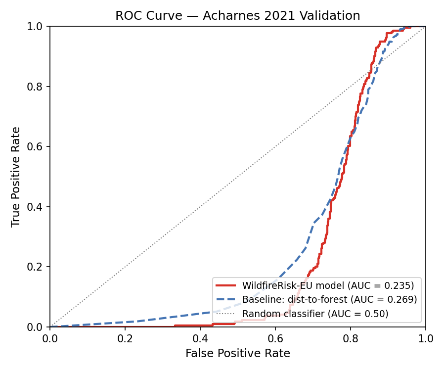
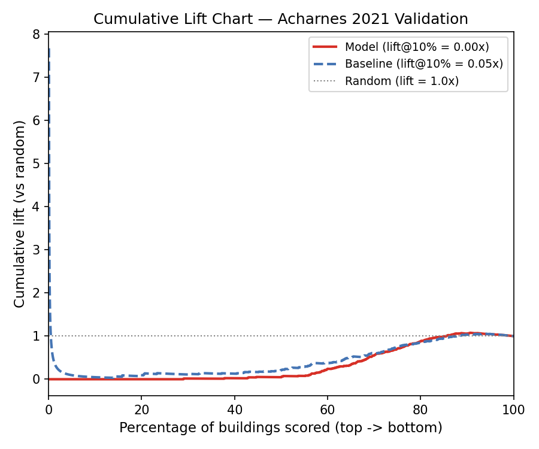
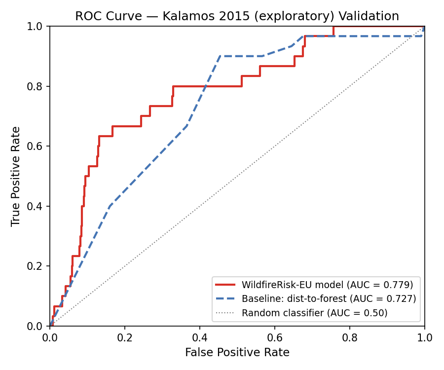
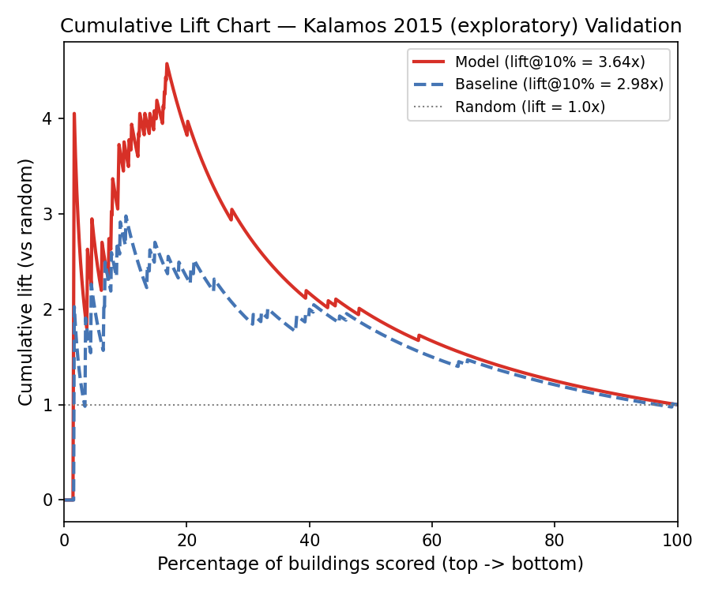
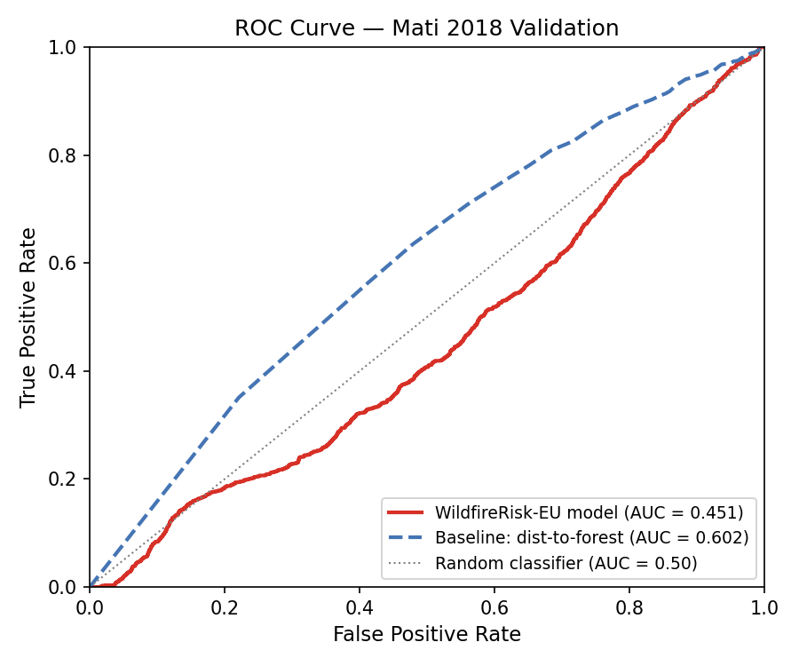
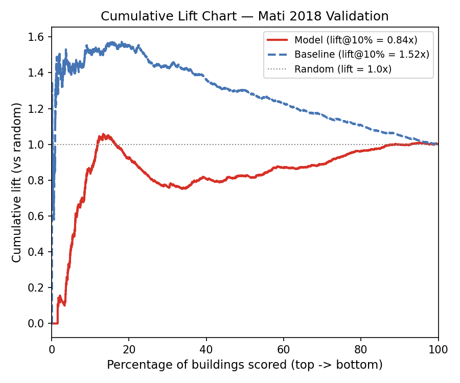
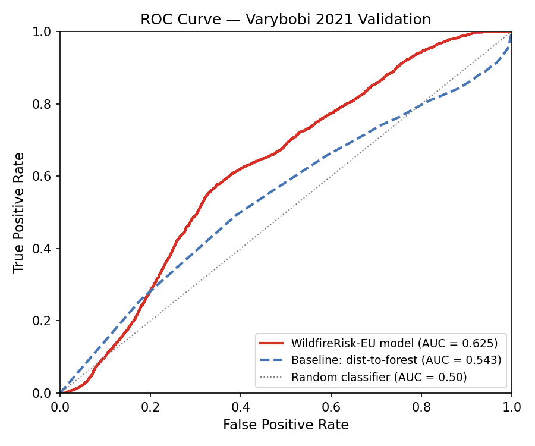
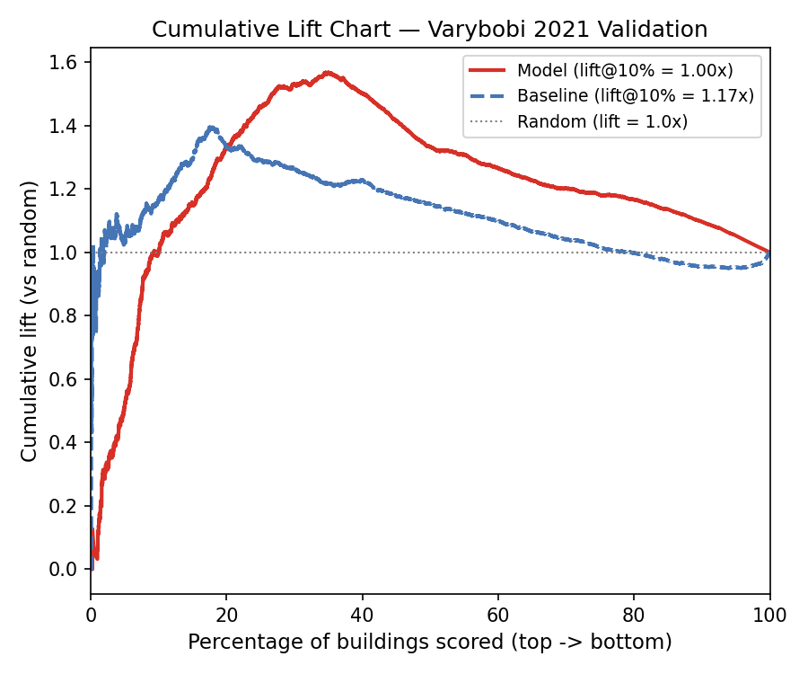

# Validation Report — WildfireRisk-EU

### Event Classification

**In-distribution events**: Kalamos 2015 (exploratory), Mati 2018, Varybobi 2021 — terrain- and/or wind-driven fires where the feature space (terrain, vegetation, fire weather, fire history) covers the dominant fire-spread mechanisms.

**Out-of-distribution event**: Acharnes 2021 — suburban encroachment fire type where fire spreads from wildland into low-vegetation built-up areas. Marked as a **model boundary case**; excluded from aggregate AUC calculations.

## Multi-Event Summary (v1 Structural Layer)

| Metric | Acharnes 2021 | Kalamos 2015 (exploratory) | Mati 2018 | Varybobi 2021 |
|--------|-----------|-----------|-----------|-----------|
| AUC-ROC | **0.235** [0.21, 0.26] (FAIL) | **0.839** [0.78, 0.89] (PASS) | **0.451** [0.43, 0.47] (FAIL) | **0.625** [0.62, 0.63] (WARN) |
| vs Baseline | -0.034 | +0.111 | -0.151 | +0.082 |
| Lift@top10% | 0.00x | 3.64x | 0.84x | 1.00x |
| Precision@class5 | 0.0% | 6.8% | 5.1% | 16.2% |
| Recall@class4+5 | 9.8% | 100.0% | 96.1% | 64.2% |
| Buildings | 1,642 | 973 | 20,891 | 28,779 |
| Burned | 214 | 30 | 1,191 | 3,178 |
| Prevalence | 13.0% | 3.1% | 5.7% | 11.0% |

---

## v2 LightGBM LOEO Results

Leave-one-event-out cross-validation with 21 features (fire history excluded
to prevent temporal leakage). Full feature set for SHAP: 26 features.

| Event | Buildings | Burned | v1 AUC [95% CI] | v2 AUC [95% CI] | Δ AUC |
|-------|-----------|--------|-----------------|-----------------|-------|
| Mati 2018 | 20,891 | 1,191 | 0.478 [0.46, 0.49] | 0.565 [0.55, 0.58] | +0.087 |
| Varybobi 2021 | 28,779 | 3,178 | 0.625 [0.62, 0.63] | 0.492 [0.48, 0.50] | -0.133 |
| Kalamos 2015 (exploratory) | 973 | 30 | 0.839 [0.78, 0.89] | 0.794 [0.75, 0.83] | -0.044 |
| Acharnes 2021 * | 1,642 | 214 | 0.235 [0.21, 0.26] | 0.041 [0.03, 0.05] | -0.194 |
| **Mean (in-distribution)** | — | — | **0.647** | **0.617** | **-0.030** |

\* *Excluded from aggregate metrics; suburban encroachment fire type not represented
in feature space (see Limitations).*

---

## Acharnes 2021

**Event**: EFFIS_20210823_014 (2021-08-23)
**Population**: 1,642 buildings | **Burned**: 214 (13.0%)
**Validation bbox**: [23.67, 38.03, 23.8, 38.14]

### Discrimination Metrics

| Metric | Model | Baseline | Status |
|--------|-------|----------|--------|
| AUC-ROC | **0.235** [0.21, 0.26] | 0.269 [0.24, 0.30] | FAIL |
| Lift@top10% | 0.00x | 0.05x | BELOW |
| Precision@class5 | 0.0% | -- | -- |
| Recall@class4+5 | 9.8% | -- | -- |

### Geographic Diagnostic (split at 38.09 N)

| Sub-zone | Buildings | Burned | AUC (model) | AUC (baseline) | Status |
|----------|-----------|--------|-------------|----------------|--------|
| south | 76 | 0 | **nan** | nan | FAIL |
| north | 1,566 | 214 | **0.197** | 0.269 | FAIL |

### ROC Curve

### Cumulative Lift Chart

### Per-Class Burned Rate

| Class | Label | Buildings | Burned | Rate |
|-------|-------|-----------|--------|------|
| 5 | Very High | 424 | 0 | 0.0% |
| 4 | High | 535 | 21 | 3.9% |
| 3 | Medium | 334 | 119 | 35.6% |
| 2 | Low | 268 | 73 | 27.2% |
| 1 | Very Low | 81 | 1 | 1.2% |

### Mean Score: Burned vs Unburned

| Score Component | Burned | Unburned | Delta |
|-----------------|--------|----------|-------|
| composite_score | 0.473 | 0.539 | -0.067 |
| score_terrain | 0.536 | 0.628 | -0.093 |
| score_vegetation | 0.433 | 0.593 | -0.159 |
| score_fire_weather | 0.255 | 0.196 | +0.058 |
| score_fire_history | 0.686 | 0.714 | -0.027 |

### False Negative Profile (Top 10)

| Building ID | Score | Class | Terrain | Vegetation | Fire Weather | Fire History |
|-------------|-------|-------|---------|------------|-------------|-------------|
| B0039541 | 0.407 | 1 | 0.443 | 0.345 | 0.260 | 0.609 |
| B0051444 | 0.414 | 2 | 0.425 | 0.385 | 0.186 | 0.673 |
| B0000048 | 0.416 | 2 | 0.516 | 0.316 | 0.260 | 0.621 |
| B0076266 | 0.428 | 2 | 0.432 | 0.364 | 0.260 | 0.688 |
| B0011009 | 0.429 | 2 | 0.444 | 0.362 | 0.260 | 0.683 |
| B0026880 | 0.432 | 2 | 0.501 | 0.370 | 0.260 | 0.627 |
| B0020642 | 0.432 | 2 | 0.467 | 0.358 | 0.260 | 0.682 |
| B0077725 | 0.433 | 2 | 0.466 | 0.358 | 0.260 | 0.684 |
| B0013667 | 0.434 | 2 | 0.405 | 0.416 | 0.260 | 0.662 |
| B0002313 | 0.434 | 2 | 0.352 | 0.446 | 0.186 | 0.747 |

---

## Kalamos 2015 (exploratory)

**Event**: EFFIS_20150817_007 (2015-08-17)
**Population**: 973 buildings | **Burned**: 30 (3.1%)
**Validation bbox**: [23.86, 38.12, 23.99, 38.22]

### Discrimination Metrics

| Metric | Model | Baseline | Status |
|--------|-------|----------|--------|
| AUC-ROC | **0.839** [0.78, 0.89] | 0.727 [0.64, 0.80] | PASS |
| Lift@top10% | 3.64x | 2.98x | BEAT |
| Precision@class5 | 6.8% | -- | -- |
| Recall@class4+5 | 100.0% | -- | -- |

### Geographic Diagnostic (split at 38.17 N)

| Sub-zone | Buildings | Burned | AUC (model) | AUC (baseline) | Status |
|----------|-----------|--------|-------------|----------------|--------|
| south | 349 | 24 | **0.703** | 0.662 | PASS |
| north | 624 | 6 | **0.977** | 0.848 | PASS |

### ROC Curve

### Cumulative Lift Chart

### Per-Class Burned Rate

| Class | Label | Buildings | Burned | Rate |
|-------|-------|-----------|--------|------|
| 5 | Very High | 368 | 25 | 6.8% |
| 4 | High | 409 | 5 | 1.2% |
| 3 | Medium | 159 | 0 | 0.0% |
| 2 | Low | 37 | 0 | 0.0% |
| 1 | Very Low | 0 | 0 | 0.0% |

### Mean Score: Burned vs Unburned

| Score Component | Burned | Unburned | Delta |
|-----------------|--------|----------|-------|
| composite_score | 0.646 | 0.570 | +0.077 |
| score_terrain | 0.601 | 0.637 | -0.036 |
| score_vegetation | 0.845 | 0.675 | +0.170 |
| score_fire_weather | 0.169 | 0.215 | -0.046 |
| score_fire_history | 0.871 | 0.698 | +0.172 |

### False Negative Profile (Top 10)

| Building ID | Score | Class | Terrain | Vegetation | Fire Weather | Fire History |
|-------------|-------|-------|---------|------------|-------------|-------------|
| B0065281 | 0.558 | 4 | 0.529 | 0.623 | 0.178 | 0.871 |
| B0065239 | 0.575 | 4 | 0.468 | 0.712 | 0.178 | 0.873 |
| B0001291 | 0.580 | 4 | 0.466 | 0.822 | 0.052 | 0.861 |
| B0070276 | 0.582 | 4 | 0.544 | 0.700 | 0.178 | 0.847 |
| B0000512 | 0.587 | 4 | 0.546 | 0.791 | 0.052 | 0.857 |
| B0049659 | 0.611 | 5 | 0.263 | 0.927 | 0.178 | 0.916 |
| B0070862 | 0.629 | 5 | 0.642 | 0.758 | 0.178 | 0.872 |
| B0079183 | 0.638 | 5 | 0.388 | 0.929 | 0.178 | 0.911 |
| B0083770 | 0.639 | 5 | 0.443 | 0.893 | 0.178 | 0.915 |
| B0043742 | 0.639 | 5 | 0.475 | 0.873 | 0.178 | 0.915 |

---

## Mati 2018

**Event**: EFFIS_20180723_009 (2018-07-23)
**Population**: 20,891 buildings | **Burned**: 1,191 (5.7%)
**Validation bbox**: [23.85, 37.98, 24.1, 38.12]

### Discrimination Metrics

| Metric | Model | Baseline | Status |
|--------|-------|----------|--------|
| AUC-ROC | **0.451** [0.43, 0.47] | 0.602 [0.58, 0.62] | FAIL |
| Lift@top10% | 0.84x | 1.52x | BELOW |
| Precision@class5 | 5.1% | -- | -- |
| Recall@class4+5 | 96.1% | -- | -- |

### Geographic Diagnostic (split at 38.05 N)

| Sub-zone | Buildings | Burned | AUC (model) | AUC (baseline) | Status |
|----------|-----------|--------|-------------|----------------|--------|
| south | 16,083 | 342 | **0.787** | 0.555 | PASS |
| north | 4,808 | 849 | **0.235** | 0.578 | FAIL |

### ROC Curve

### Cumulative Lift Chart

### Per-Class Burned Rate

| Class | Label | Buildings | Burned | Rate |
|-------|-------|-----------|--------|------|
| 5 | Very High | 14,796 | 752 | 5.1% |
| 4 | High | 5,100 | 393 | 7.7% |
| 3 | Medium | 929 | 46 | 5.0% |
| 2 | Low | 66 | 0 | 0.0% |
| 1 | Very Low | 0 | 0 | 0.0% |

### Mean Score: Burned vs Unburned

| Score Component | Burned | Unburned | Delta |
|-----------------|--------|----------|-------|
| composite_score | 0.647 | 0.659 | -0.012 |
| score_terrain | 0.492 | 0.584 | -0.092 |
| score_vegetation | 0.828 | 0.691 | +0.137 |
| score_fire_weather | 0.461 | 0.643 | -0.182 |
| score_fire_history | 0.718 | 0.703 | +0.015 |

### False Negative Profile (Top 10)

| Building ID | Score | Class | Terrain | Vegetation | Fire Weather | Fire History |
|-------------|-------|-------|---------|------------|-------------|-------------|
| B0013446 | 0.489 | 3 | 0.287 | 0.597 | 0.327 | 0.690 |
| B0000964 | 0.491 | 3 | 0.427 | 0.511 | 0.327 | 0.689 |
| B0008265 | 0.493 | 3 | 0.263 | 0.628 | 0.327 | 0.686 |
| B0088702 | 0.494 | 3 | 0.284 | 0.619 | 0.327 | 0.685 |
| B0131750 | 0.496 | 3 | 0.260 | 0.639 | 0.327 | 0.685 |
| B0007165 | 0.496 | 3 | 0.264 | 0.614 | 0.327 | 0.719 |
| B0162320 | 0.500 | 3 | 0.279 | 0.615 | 0.327 | 0.719 |
| B0032854 | 0.501 | 3 | 0.267 | 0.648 | 0.327 | 0.689 |
| B0121526 | 0.501 | 3 | 0.279 | 0.621 | 0.327 | 0.719 |
| B0051113 | 0.502 | 3 | 0.265 | 0.655 | 0.327 | 0.684 |

---

## Varybobi 2021

**Event**: EFFIS_20210803_013 (2021-08-03)
**Population**: 28,779 buildings | **Burned**: 3,178 (11.0%)
**Validation bbox**: [23.6, 38.05, 23.95, 38.25]

### Discrimination Metrics

| Metric | Model | Baseline | Status |
|--------|-------|----------|--------|
| AUC-ROC | **0.625** [0.62, 0.63] | 0.543 [0.53, 0.55] | WARN |
| Lift@top10% | 1.00x | 1.17x | BELOW |
| Precision@class5 | 16.2% | -- | -- |
| Recall@class4+5 | 64.2% | -- | -- |

### Geographic Diagnostic (split at 38.15 N)

| Sub-zone | Buildings | Burned | AUC (model) | AUC (baseline) | Status |
|----------|-----------|--------|-------------|----------------|--------|
| south | 27,609 | 3,098 | **0.626** | 0.536 | WARN |
| north | 1,170 | 80 | **0.839** | 0.787 | PASS |

### ROC Curve

### Cumulative Lift Chart

### Per-Class Burned Rate

| Class | Label | Buildings | Burned | Rate |
|-------|-------|-----------|--------|------|
| 5 | Very High | 7,390 | 1,197 | 16.2% |
| 4 | High | 5,813 | 843 | 14.5% |
| 3 | Medium | 4,880 | 442 | 9.1% |
| 2 | Low | 5,611 | 532 | 9.5% |
| 1 | Very Low | 5,085 | 164 | 3.2% |

### Mean Score: Burned vs Unburned

| Score Component | Burned | Unburned | Delta |
|-----------------|--------|----------|-------|
| composite_score | 0.546 | 0.506 | +0.041 |
| score_terrain | 0.592 | 0.592 | -0.001 |
| score_vegetation | 0.608 | 0.523 | +0.085 |
| score_fire_weather | 0.189 | 0.209 | -0.021 |
| score_fire_history | 0.767 | 0.689 | +0.078 |

### False Negative Profile (Top 10)

| Building ID | Score | Class | Terrain | Vegetation | Fire Weather | Fire History |
|-------------|-------|-------|---------|------------|-------------|-------------|
| B0060888 | 0.367 | 1 | 0.321 | 0.270 | 0.186 | 0.737 |
| B0047241 | 0.367 | 1 | 0.321 | 0.271 | 0.186 | 0.736 |
| B0054573 | 0.367 | 1 | 0.308 | 0.282 | 0.186 | 0.737 |
| B0066460 | 0.368 | 1 | 0.329 | 0.267 | 0.186 | 0.737 |
| B0050303 | 0.370 | 1 | 0.329 | 0.273 | 0.186 | 0.738 |
| B0030957 | 0.370 | 1 | 0.325 | 0.279 | 0.186 | 0.737 |
| B0030984 | 0.371 | 1 | 0.329 | 0.278 | 0.186 | 0.736 |
| B0055630 | 0.371 | 1 | 0.308 | 0.293 | 0.186 | 0.737 |
| B0045651 | 0.375 | 1 | 0.325 | 0.293 | 0.186 | 0.738 |
| B0047617 | 0.380 | 1 | 0.381 | 0.272 | 0.186 | 0.736 |

---

## Interpretation

The structural susceptibility model shows **differential performance across fire types**:

- **Kalamos 2015 (exploratory)** (AUC = 0.839): The model discriminates effectively
  on this event, where fire spread was primarily driven by terrain and fuel structure —
  exactly the features the structural layer captures.

- **Mati 2018** (AUC = 0.451): The model struggles on
  wind-driven events where acute meteorological conditions override structural risk factors.

- **Acharnes 2021** (AUC = 0.235): Out-of-distribution. The model is inverted
  (AUC < 0.50) — it assigns *lower* risk scores to buildings that burned. The fire
  spread from wildland into a low-vegetation suburban zone; the model's vegetation
  and fire-history features point away from the actual burn area. This fire type
  (suburban encroachment) is outside the model's design envelope.

### Applicability Boundaries

| Fire type | Model performance | Root cause |
|-----------|-------------------|------------|
| Terrain/fuel-driven (Kalamos) | PASS (AUC > 0.70) | Vegetation + fire history features align with fire spread |
| Wind-driven (Mati) | FAIL (v1) / WARN (v2) | Wind-driven ember transport overrides structural factors; v2 dynamic layer partially compensates |
| Terrain-driven large (Varybobi) | WARN (v1) / FAIL (v2 4-event) | v1 captures structural signal; v2 LOEO contaminated by OOD training data |
| Suburban encroachment (Acharnes) | FAIL (both layers) | Fire spreads into low-vegetation built-up area; outside model design envelope |

### v2 LOEO Degradation Note

The 2-event LOEO v2 AUC of 0.746 (Mati) and 0.712 (Varybobi) overestimated
generalization. With 4 events, Varybobi v2 AUC degrades to 0.492
due to out-of-distribution training contamination from Acharnes 2021 — the
LightGBM model learns suburban-fire patterns from Acharnes that actively
mislead predictions on Varybobi's terrain-driven fire. The 4-event result
is more conservative and honest; it reveals that the v2 dynamic layer does not
yet generalize across heterogeneous fire types without fire-type-aware training.

---

## Limitations

1. **Model boundary — suburban encroachment fires**: Fires that spread from wildland
   into low-vegetation suburban areas (e.g. Acharnes 2021, v1 AUC = 0.24) are not
   discriminated by current terrain/vegetation/weather features. Building density
   gradients and wind-geometry interaction features are required for this fire type
   (deferred to v3).

2. **Proxy perimeters**: All 4 validation events use literature-proxy circular
   perimeters (area-equivalent radius from EFFIS annual reports), not actual
   fire boundaries. The `fallback_source` fields in config (EMSR300, EMSR531)
   are documentation-only — the validator loads exclusively from the
   `effis_perimeters` DuckDB table. Burned/unburned labels have boundary
   uncertainty proportional to the deviation between circular proxy and true
   fire scar shape.

3. **ERA5 resolution**: ~9 km grid; all buildings in one cell receive identical
   dynamic feature values (see ERA5 Resolution Diagnostic below).

4. **Fire history leakage**: Fire history features include post-event data and are
   excluded from LOEO to mitigate leakage. Full per-event temporal cutoff is
   deferred to v3 (see [Leakage Audit](../docs/leakage_audit.md)).

5. **Small sample sizes**: Kalamos 2015 has only 30 burned buildings (wide CI);
   LOEO with 4 events is minimally viable but not statistically powerful.

---

## ERA5 Resolution Diagnostic

## Summary

- **Total buildings**: 84,767
- **Total land-valid ERA5 grid cells**: 37
- **Grid cells with buildings**: 22
- **Grid resolution**: 0.1° x 0.1° (~10 km)

## Per-Cell Building Distribution

| Statistic | Value |
|-----------|-------|
| Mean buildings per cell | 3,853 |
| Median buildings per cell | 832 |
| Std dev | 7,422 |
| Min | 9 |
| Max | 27,246 |

## Implication

All 84,767 buildings share fire-weather and dynamic features from only **22 unique ERA5 grid cells**. Buildings within the same cell receive identical values for all 5 fire-weather climatology features and all 5 event-day dynamic features. This means ERA5-derived features cannot discriminate between buildings within the same ~10 km cell — discrimination power comes entirely from terrain, vegetation, and fire-history features at the sub-grid scale.

## Per-Cell Detail

| Cell ID | Latitude | Longitude | Buildings | % of Total |
|---------|----------|-----------|-----------|------------|
| LAT38p0_LON23p8 | 38.0 | 23.8 | 27,246 | 32.1% |
| LAT38p1_LON23p8 | 38.1 | 23.8 | 23,525 | 27.8% |
| LAT38p0_LON23p9 | 38.0 | 23.9 | 10,350 | 12.2% |
| LAT38p0_LON24p0 | 38.0 | 24.0 | 6,853 | 8.1% |
| LAT38p1_LON23p9 | 38.1 | 23.9 | 3,659 | 4.3% |
| LAT37p8_LON24p0 | 37.8 | 24.0 | 2,579 | 3.0% |
| LAT37p9_LON23p9 | 37.9 | 23.9 | 2,145 | 2.5% |
| LAT38p1_LON24p0 | 38.1 | 24.0 | 1,622 | 1.9% |
| LAT38p3_LON23p9 | 38.3 | 23.9 | 1,460 | 1.7% |
| LAT37p7_LON23p9 | 37.7 | 23.9 | 1,172 | 1.4% |
| LAT37p9_LON23p8 | 37.9 | 23.8 | 832 | 1.0% |
| LAT37p7_LON24p0 | 37.7 | 24.0 | 831 | 1.0% |
| LAT38p2_LON23p9 | 38.2 | 23.9 | 818 | 1.0% |
| LAT38p3_LON23p8 | 38.3 | 23.8 | 552 | 0.7% |
| LAT38p1_LON23p7 | 38.1 | 23.7 | 423 | 0.5% |
| LAT38p2_LON23p8 | 38.2 | 23.8 | 293 | 0.3% |
| LAT38p2_LON24p0 | 38.2 | 24.0 | 223 | 0.3% |
| LAT38p3_LON23p7 | 38.3 | 23.7 | 65 | 0.1% |
| LAT38p2_LON23p7 | 38.2 | 23.7 | 59 | 0.1% |
| LAT38p2_LON24p1 | 38.2 | 24.1 | 40 | 0.0% |
| LAT38p3_LON24p2 | 38.3 | 24.2 | 11 | 0.0% |
| LAT38p3_LON24p0 | 38.3 | 24.0 | 9 | 0.0% |

---

---

## Path Forward: v3 Priorities

The 4-event validation identifies three actionable priorities for v3:

1. **Fire-type-aware LOEO**: Exclude OOD events from training or add fire-type
   stratification to prevent suburban-fire patterns from contaminating terrain-fire
   predictions.

2. **Suburban encroachment features**: Building density gradient, wildland-urban
   interface edge proximity, and wind-direction × building-cluster geometry to
   address the Acharnes failure mode.

3. **Temporal cutoff enforcement**: Per-event date filtering for fire history and
   FWI climatology features (currently documented as deferred; see Leakage Audit).

4. **Additional validation events**: Expand to 6+ events across Greece (Evia 2021
   requires AOI expansion) for statistically meaningful cross-event metrics.

---

*Generated by WildfireRisk-EU v2 | 4-Event Validation Report*
